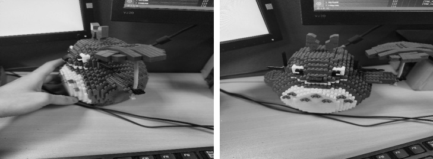
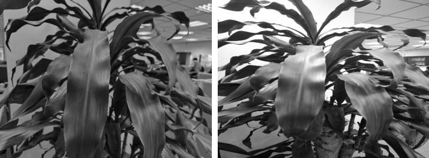

This repo implements code to compare views between a pair of image. It means that the task of this repo is to determine whether two given images have the same captured view or different. Like for instance, if image A captures the view in front of an object, and image B captures its left view, this pair will be discriminative. This will facilitate lots of AI tasks while it obligates data collectors have to capture images obey the pre-determined law. This implementation contains two components as the main flow, they are YOLOv8 for object detection component and LOFTR for images matching component.

<div align="center">
  <p>
      
      <figcaption>changed view result</figcaption>
  </p>
  <p>
      
      <figcaption>unchanged view result</figcaption>
  </p>

<br>

<div>


## To retrain yolov8 for your custom datasets to detect objects that will be compared view, please follow the official github
https://github.com/ultralytics/ultralytics

Weight after training is put into *./yolov8* folder with name *best.pt*. If this weight is not supplied, system will use whole image to match keypoints without crop bounding boxes of the objects.


## Inference
To reproduce the testing results, you need to supply a *pair.txt* file to show all the image pairs.
```shell
python3 app.py --input_dir 'path_to_your_images' --input_pairs 'path_to_file_containing_pairs_of_image'
```

